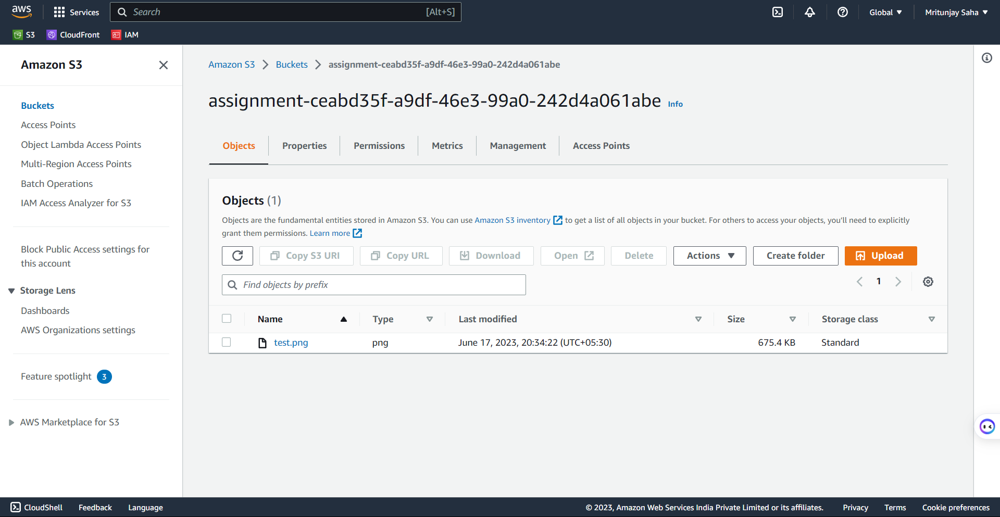

# Express server to generate signed cloudfront url

### Screenshot of the permissions of the S3 bucket, specifically the part which says that all public access is blocked.


### Screenshot of the bucket policy


### Screenshot of the Access control list of the S3 bucket.


### Screenshot of the S3 bucket which shows the name of the single image file uploaded on it.



### Screenshot of the General page of the cloudfront distribution.


### Screenshot of the Origins page of the cloudfront distribution.


# How to start the express server

### Install packages

```bash
npm i
```

### Start the server

```bash
npm start
```
